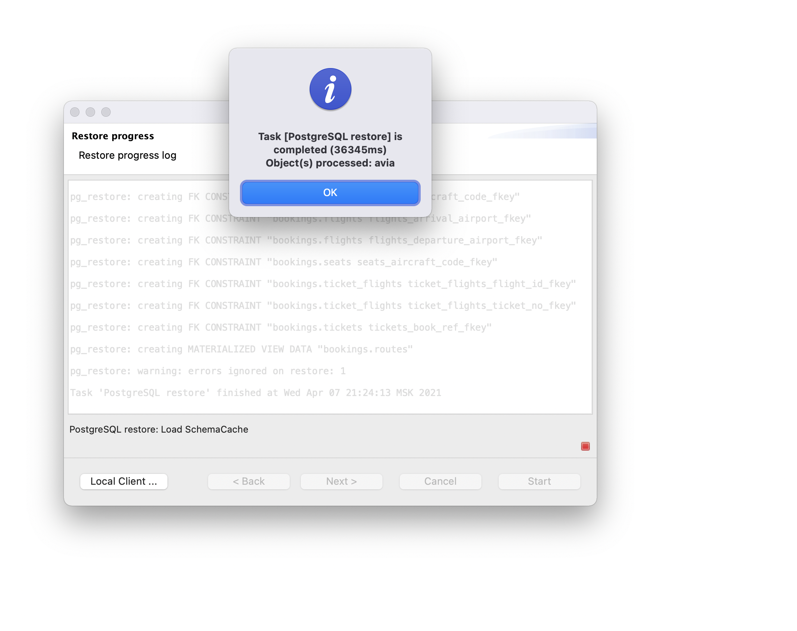
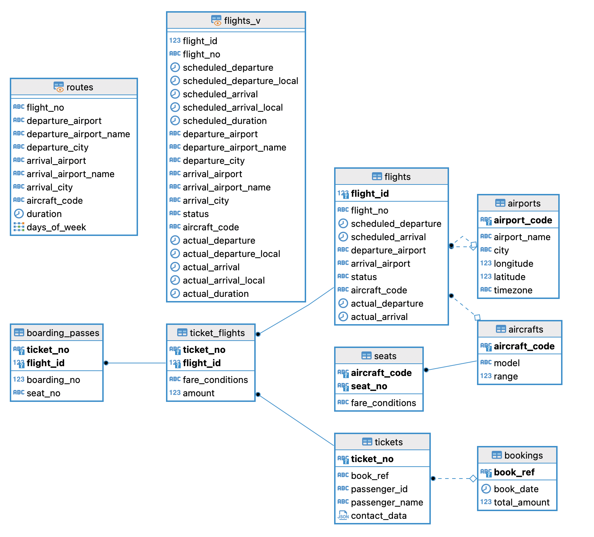

# Проектная работа по модулю "SQL и получение данных"

### 1. В работе использовался локальный подключения

Скриншот восстановления базы данных из *.backup файла

 

### 2. Скриншот ER-диаграммы из DBeaver

 

## 3. Краткое описание БД

### Таблицы:
1. **bookings** - бронирования
2. **tickets** - билеты
3. **flights** - рейсы
4. **ticket_flights** - билеты/рейсы (отношение многие-ко-многим между таблицами **tickets** и **flights**, поскольку кроме того, что на один рейс может быть зарегестрировано множество билетов, один билет может включать более одного перелета)
5. **boarding_passes** - посадочные талоны
6. **airports** - аэропорты
7. **aircrafts** - самолеты
8. **seats** - места в самолете

### Представления:

1. **routes** - маршруты (материализованный)
2. **flights_v** - перелеты

 

## 4. Развернутый анализ БД - описание таблиц, логики, связей и бизнес области. Бизнес задачи, которые можно решить, используя БД

### 1. Таблица bookings

- Представляет бронирования. Каждое бронирование имеет свой уникальный номер **book_ref** из 6 символов. В одно бронирование можно включить несколько пассажиров, каждому из которых выписывается отдельный билет
- Колонки
  - `book_ref` - номер бронирования
  - `book_date` - дата бронирования
  - `total_amount` - полная сумма бронирования
- Первичный ключ - `book_ref`

### 2. Таблица tickets

- Представляет билеты. Билет может быть выписан для одного пассажира, содержит информацию о нем и имеет уникальный номер **ticket_no**, состоящий из 13 цифр
- Колонки
  - `ticket_no` - номер билета
  - `book_ref` - номер бронирования
  - `passenger_id` - идентификатор пассажира
  - `passenger_name` - имя пассажира
  - `contact_data` - контактные данные пассажира
- Первичный ключ - `ticket_no`
- Внешние ключи
  - `tickets_book_ref_fkey` - `book_ref` на поле `book_ref` таблицы `book_ref`

### 3. Таблица flights

- Представляет рейсы. Каждый рейс следует из одного аэропорта в другой. Рейсы с одним номером имеют одинаковые пункты вылета и назначения, но будут отличаться датой отправления. У каждого рейса есть запланированные дата и время вылета (`scheduled_departure`) и прибытия (`scheduled_arrival`). Реальные дата и время вылета (`actual_departure`) и прибытия (`actual_arrival`) могу отличаться. Если у рейса отсутствует значение в поле `actual_departure`, значит он был отменен. Также отменнные рейсы можно найти по статусу **Cancelled** в поле `status`. Стоит отметить, что даже если на рейс не было зарегистрированно ни одного пассажира и/или не получен ни одни посадочный талон, рейс все равно может состояться
- Колонки
  - `flight_id` - идентификатор рейса
  - `flight_no` - номер рейса
  - `scheduled_departure` - время вылета по расписанию
  - `scheduled_arrival` - время прилета по расписанию
  - `departure_airport` - аэропорт отправления
  - `arrival_airport` - аэропорт прибытия
  - `status` - статус рейса
  - `aircraft_code` - код самолета, IATA
  - `actual_departure` - фактическое время вылета
  - `actual_arrival` - фактическое время прилета
- Первичный ключ
  - Естественный - уникальная комбинация полей `flight_no` и `scheduled_departure`
  - Суррогатный - `flight_id`
- Внешние ключи
  - `flights_aircraft_code_fkey` - `aircraft_code` на поле `aircraft_code` таблицы `aircrafts`
  - `flights_arrival_airport_fkey` - `arrival_airport` на поле `airport_code` таблицы `airports`
  - `flights_departure_airport_fkey` - `departure_airport` на поле `airport_code` таблицы `airports`

### 4. Таблица ticket_flights

- Представляет связь между билетами и рейсами, поскольку как один рейс может включать множество билетов, так и один билет может включать один или несколько перелетов. Несколько перелетов могут включаться в билет в случаях, когда нет прямого рейса, соединяющего пункты отправления и назначения (полет с пересадками), либо когда билет взят "туда и обратно". Обеспечивает связь многие-ко-многим между таблицами **tickets** и **flights**
- Колонки
  - `ticket_no` - номер билета
  - `flight_id` - идентификатор рейса
  - `fare_conditions` - класс обслуживания
  - `amount` - стоимость перелета
- Первичный ключ - составной `ticket_no, flight_id`
- Внешние ключи
  - `ticket_flights_flight_id_fkey` - `flight_id` на поле `flight_id` таблицы `flights`
  - `ticket_flights_ticket_no_fkey` - `ticket_no` на поле `ticket_no` таблицы `tickets`

### 5. Таблицы boarding_passes

- Представляет посадочные талоны на рейсы. При регистрации на рейс каждому пассажиру выдается посадочный талон, в котором указано место в самолете. Пассажир может зарегистрироваться только на тот рейс, который указан у него в билете. Комбинация рейса и места в самолете должна быть уникальной, чтобы не допустить выдачу двух посадочных талонов на одно место
- Колонки
  - `ticket_no` - номер билета
  - `flight_id` - идентификатор рейса
  - `boarding_no` - номер посадочного талона
  - `seat_no` - номер места в самолете
- Первичный ключ - составной `flight_id, ticket_no`
- Внешние ключи
  - `boarding_passes_ticket_no_fkey` - `(ticket_no,flight_id)` на поля `(ticket_no,flight_id)` таблицы `ticket_flights`

### 6. Таблица airports

- Представляет аэропорты. Каждый аэропорт идентифицируется уникальным трехбуквенным кодом
- Колонки
  - `airport_code` - код аэропорта
  - `airport_name` - название аэропорта
  - `city` - город расположения аэропорта
  - `longitude` - координаты аэропорта: долгота
  - `latitude` - координаты аэропорта: широта
  - `timezone` - временная зона аэропорта
- Первичный ключ - `airport_code`

### 7. Таблица aircrafts

- Представляет воздушные судна. Каждый самолет может быть идентифицирован по уникальному трехсимвольному коду
- Колонки
  - `aircraft_code` - код самолета, IATA
  - `model` - модель самолета
  - `range` - максимальная дальность полета, км
- Первичный ключ - `aircraft_code`

### 8. Таблица seats

- Представляет места на самолете. Места определяют схему салона каждой модели самолета. Каждое место определяется своим номером и имеет закрепленный за ним класс обслуживания
- Колонки
  - `aircraft_code` - код самолета, IATA
  - `seat_no` - номер места
  - `fare_conditions` - класс обслуживания
- Первичный ключ - составной `aircraft_code, seat_no`
- Внешние ключи
  - `seats_aircraft_code_fkey` - `aircraft_code` на поле `aircraft_code` таблицы `aircrafts`

 

### Бизнес задачи

- Анализ средней загрузки рейсов по определенным направлениям с целью оптимизации стоимости билетов. То же самое можно сделать еще и в разрезе классов обслуживания, а также с учетом сезонности
- Предоставление скидок и/или повышение класса обслуживания с небольшой доплатой для постоянных клиентов (пассажиров). Например, если клиент выполнил определенное кол-во перелетов за какой-то промежуток времени, то можно предлагать ему повышение класса обслуживания по сниженной цене
- Оптимизация расписания рейсов в аэропортах в зависимости от времени задержки рейсов. Такие задержки могут конечно носить случайный характер, но все же можно проанализировать, и в случае, если характер задержек носит не случайный характер, то можно задуматься об оптимизации внутренних процессов аэропорта или принять другие меры
- Анализ популярности маршрутов между городами, для которых нет прямых рейсов. Опять же это может носить сезонный характер. Если выяснится, что стали популярными рейсы в города в определенное время года, то можно на это время пустить прямые рейсы