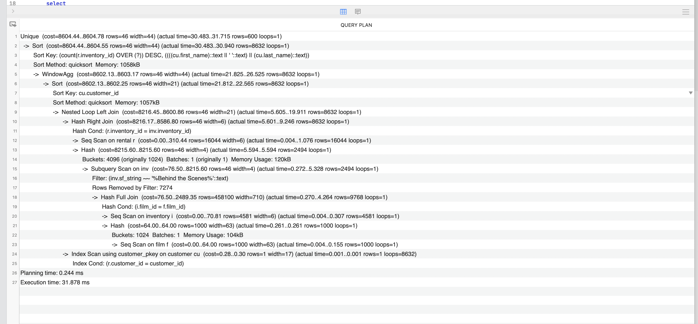
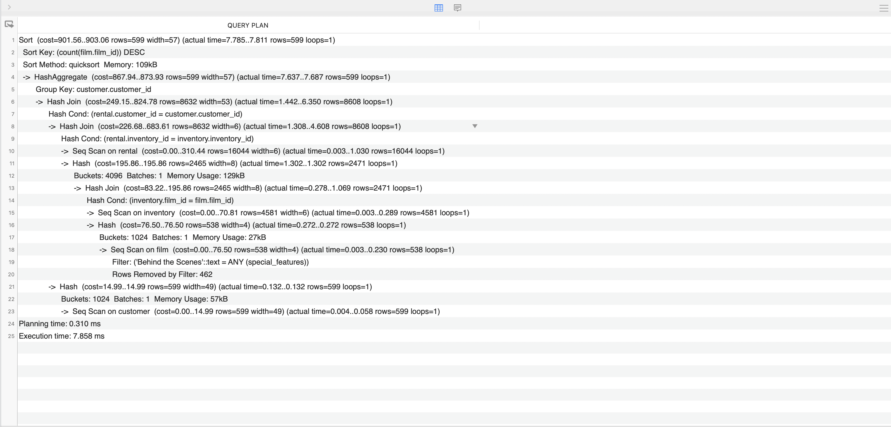
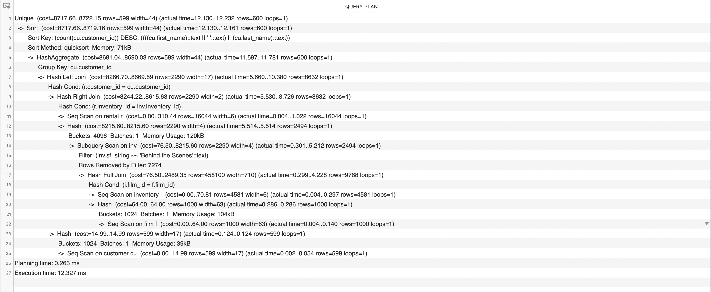

### Сделайте запрос к таблице rental. Используя оконую функцию добавьте колонку с порядковым номером аренды для каждого пользователя (сортировать по `rental_date`)

```sql
select
  rental_id,
  rental_date,
  customer_id,
  row_number() over (partition by customer_id order by rental_date asc) as customer_rental_number
from
  rental;
```

### Для каждого пользователя подсчитайте сколько он брал в аренду фильмов со специальным атрибутом Behind the Scenes
- Напишите этот запрос
- Создайте материализованное представление с этим запросом
- Обновите материализованное представление
- Напишите три варианта условия для поиска Behind the Scenes

#### **Первый вариант**
```sql
select
  customer.customer_id,
  customer.first_name,
  customer.last_name,
  customer.email,
  count(film.film_id)
from
  customer
left join
  rental on rental.customer_id = customer.customer_id
left join
  inventory on rental.inventory_id = inventory.inventory_id
left join
  film on inventory.film_id = film.film_id
where
  film.special_features::text like '%Behind the Scenes%'
group by
  customer.customer_id
```

#### **Второй вариант**
```sql
select
  customer.customer_id,
  customer.first_name,
  customer.last_name,
  customer.email,
  count(film.film_id)
from
  customer
left join
  rental on rental.customer_id = customer.customer_id
left join
  inventory on rental.inventory_id = inventory.inventory_id
left join
  film on inventory.film_id = film.film_id
where
  'Behind the Scenes' = any(film.special_features)
group by
  customer.customer_id
```

#### **Третий вариант**
```sql
with cte_film as (
  select
    film.film_id,
    film.special_features,
    generate_subscripts(film.special_features, 1) as sf
  from
    film
)

select
  customer.customer_id,
  customer.first_name,
  customer.last_name,
  customer.email,
  count(film.film_id)
from
  customer
left join
  rental on rental.customer_id = customer.customer_id
left join
  inventory on rental.inventory_id = inventory.inventory_id
left join
  cte_film as film on inventory.film_id = film.film_id
where
  film.special_features[sf] = 'Behind the Scenes'
group by
  customer.customer_id
```

#### **Материализованное представление**

```sql
create materialized view
  user_film_count
as
  select
    customer.customer_id,
    customer.first_name,
    customer.last_name,
    customer.email,
    count(film.film_id)
  from
    customer
  left join
    rental on rental.customer_id = customer.customer_id
  left join
    inventory on rental.inventory_id = inventory.inventory_id
  left join
    film on inventory.film_id = film.film_id
  where
    film.special_features::text like '%Behind the Scenes%'
  group by
    customer.customer_id
with no data;
```

```sql
refresh materialized view user_film_count;
```

---

### Дополнительная часть:
- Открыть по ссылке SQL запрос [https://letsdocode.ru/sql-hw5.sql], сделать explain analyze запроса
- Основываясь на описании запроса, найдите узкие места и опишите их
- Сравните с Вашим запросом из основной части (если Ваш запрос изначально укладывается в 15мс - отлично!)
- Оптимизируйте запрос, сократив время обработки до максимум 15мс
- Сделайте построчное описание explain analyze на русском языке оптимизированного запроса

### Запрос
```sql
select distinct
  cu.first_name || ' ' || cu.last_name as name,
  count(ren.iid) over (partition by cu.customer_id)
from
  customer cu
full outer join
  (
    select
      *,
      r.inventory_id as iid,
      inv.sf_string as sfs,
      r.customer_id as cid
    from
      rental r
    full outer join
      (
        select
          *,
          unnest(f.special_features) as sf_string
        from
          inventory i
        full outer join
          film f on f.film_id = i.film_id
        ) as inv on r.inventory_id = inv.inventory_id
  ) as ren on ren.cid = cu.customer_id
where
  ren.sfs like '%Behind the Scenes%'
order by
  count desc
```

### Explain analyze запроса

#### Запрос выполняется за примерно 32мс

### Узкие места

1. Комбинация сортировки по `count(ren.iid) over (partition by cu.customer_id)` и оконной функции
2. Выборка большого количества колонок в подзапросах
3. Нахождение подстроки по шаблону

### Сравнение с моим запросом (второй вариант)

```sql
select
  customer.customer_id,
  customer.first_name,
  customer.last_name,
  customer.email,
  count(film.film_id)
from
  customer
left join
  rental on rental.customer_id = customer.customer_id
left join
  inventory on rental.inventory_id = inventory.inventory_id
left join
  film on inventory.film_id = film.film_id
where
  'Behind the Scenes' = any(film.special_features)
group by
  customer.customer_id
```

### Explain analyze моего запроса

#### Запрос выполняется за примерно 8мс

### Оптимизированный запрос

```sql
select distinct
  cu.first_name || ' ' || cu.last_name as name,
  count(cu.customer_id) as film_count
from
  customer cu
full outer join
  (
    select
      r.inventory_id as iid,
      inv.sf_string as sfs,
      r.customer_id as cid
    from
      rental r
    full outer join
      (
        select
          inventory_id,
          unnest(f.special_features) as sf_string
        from
          inventory i
        full outer join
          film f on f.film_id = i.film_id
        ) as inv on r.inventory_id = inv.inventory_id
  ) as ren on ren.cid = cu.customer_id
where
  ren.sfs = 'Behind the Scenes'
group by
  cu.customer_id
order by
  film_count desc
```

1. Посколько мы сделали `unnest` нам больше не нужно искать по подстроке, используя шаблон `%Behind the Scenes%`. Экономия 10мс
2. Оконная функция выполняется долго. Вместо этого можно использовать простую группировку по пользователю. Экономия 9мс

### Explain analyze оптимизированного запроса

#### Запрос выполняется за примерно 12мс

### Построчное описание оптимизированного запроса

```
Unique  (cost=8717.66..8722.15 rows=599 width=44) (actual time=11.923..12.038 rows=600 loops=1)
```
Удаление дубликатов

```
Sort  (cost=8717.66..8719.16 rows=599 width=44) (actual time=11.922..11.967 rows=600 loops=1)
Sort Key: (count(cu.customer_id)) DESC, ((((cu.first_name)::text || ' '::text) || (cu.last_name)::text))
Sort Method: quicksort  Memory: 71kB
```
Сортировка результатов по ключу `count`. Используется алгоритм быстрой сортировки. Затрачено 71kB памяти

```
HashAggregate  (cost=8681.04..8690.03 rows=599 width=44) (actual time=11.415..11.563 rows=600 loops=1)
Group Key: cu.customer_id
```
Группировка данных и агрегация по ключу `cu.customer_id`

```
Hash Left Join  (cost=8266.70..8669.59 rows=2290 width=17) (actual time=5.580..10.290 rows=8632 loops=1)
Hash Cond: (r.customer_id = cu.customer_id)
```
Выполнение left join. Условие `r.customer_id = cu.customer_id`

```
Hash Right Join  (cost=8244.22..8615.63 rows=2290 width=2) (actual time=5.447..8.694 rows=8632 loops=1)
Hash Cond: (r.inventory_id = inv.inventory_id)
```
Выполнение right join. Условие `r.inventory_id = inv.inventory_id`

```
Seq Scan on rental r  (cost=0.00..310.44 rows=16044 width=6) (actual time=0.003..1.029 rows=16044 loops=1)
```
Сканирование всей таблицы `rental` построчно как часть предыдущей операции Hash Right Join

```
Hash  (cost=8215.60..8215.60 rows=2290 width=4) (actual time=5.429..5.429 rows=2494 loops=1)
Buckets: 4096  Batches: 1  Memory Usage: 120kB
```
Создание хэш-таблицы как часть предыдущей операции Hash Right Join. Затрачено 120kB памяти

```
Subquery Scan on inv  (cost=76.50..8215.60 rows=2290 width=4) (actual time=0.303..5.128 rows=2494 loops=1)
Filter: (inv.sf_string = 'Behind the Scenes'::text)
Rows Removed by Filter: 7274
```
Сканирование таблицы `inv` и ее фильтрация по условию `inv.sf_string = 'Behind the Scenes'`.
Отфильтровано 7274 строки

```
Hash Full Join  (cost=76.50..2489.35 rows=458100 width=710) (actual time=0.301..4.265 rows=9768 loops=1)
Hash Cond: (i.film_id = f.film_id)
```
Выполнение full join. Условие `i.film_id = f.film_id`

```
Seq Scan on inventory i  (cost=0.00..70.81 rows=4581 width=6) (actual time=0.003..0.293 rows=4581 loops=1)
```
Сканирование всей таблицы `inventory` построчно в произвольном порядке как часть предыдущей операции Hash Full Join

```
Hash  (cost=64.00..64.00 rows=1000 width=63) (actual time=0.290..0.290 rows=1000 loops=1)
Buckets: 1024  Batches: 1  Memory Usage: 104kB
```
Создание хэш-таблицы как часть предыдущей операции Hash Full Join. Затрачено 104kB памяти

```
Seq Scan on film f  (cost=0.00..64.00 rows=1000 width=63) (actual time=0.004..0.155 rows=1000 loops=1)
```
Сканирование всей таблицы `film` построчно в произвольном порядке как часть предыдущей операции Hash

```
Hash  (cost=14.99..14.99 rows=599 width=17) (actual time=0.126..0.126 rows=599 loops=1)
Buckets: 1024  Batches: 1  Memory Usage: 39kB
```
Создание хэш-таблицы как часть предыдущей операции Hash Left Join. Затрачено 39kB памяти

```
Seq Scan on customer cu  (cost=0.00..14.99 rows=599 width=17) (actual time=0.002..0.055 rows=599 loops=1)
```
Сканирование всей таблицы `customer` построчно в произвольном порядке как часть предыдущей операции Hash